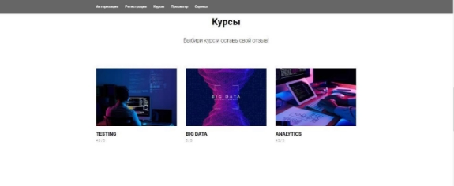

#Cценарные кейсы**  

**SCase-1 Пользователь переходит на сайт** 

1. Неавторизованного пользователя система перенаправляет на страницу с формой регистрации. 
1. Авторизованного пользователя система перенаправляет на страницу с окном входа, где он сможет ввести свои данные. 

**SCase-2 Регистрация пользователя** 

1. Неавторизованный пользователь открывает главную страницу сайта. 
1. Пользователь видит окно регистрации. 
1. Пользователь вводит ФИО, E-mail, пароль. 
1. Пользователь жмет кнопку «Зарегистрироваться». Система проверяет корректность введенных данных, в случае ошибки, пользователь получает сообщение о введении неправильных данных или о том  что такие данные уже зарегистрированы. Если данные корректны они вносятся в БД. 

**SCase-3 Авторизация пользователя** 

1. Пользователь переходит на форму авторизации. 
1. Пользователь вводит данные заранее зарегистрированного аккаунта. 
1. Пользователь нажимает кнопку «Войти». 
1. Система проверяет введенные данные, если пользователь ввел неправильную информацию, то система выдает ошибку о некорректности введенных данных. Если данные введены корректно, то система перенаправляет пользователя на главное окно со списком курсов. 

**SCase-4 Главная страница** 

1. Пользователь видит главную страницу сайта, на которой перечислены курсы и их оценка. 
1. Пользователь кликает на курс, к которому хочет оставить отзыв. 
1. Система перенаправляет пользователя на страницу курса. 

**SCase-5 Страница курса** 

1. Пользователь видит отзывы учеников, прошедших данный курс, их имена и аватары. 
1. Пользователь нажимает на кнопку «оставить Отзыв».  
1. Система перенаправляет пользователя на страницу ввода отзыва. 

**SCase-6 Страница ввода отзыва** 

1. При переходе на страницу пользователю открывается форма, где он может оставить свой отзыв и оценить курс по 5 бальной шкале. 
1. Пользователь нажимает кнопку «Опубликовать отзыв». 
1. Система проверяет введенные данные на количество символов и ненормативную лексику. Если данные корректны, то система публикует отзыв и перенаправляет пользователя на главную страницу сайта. Если данные не прошли проверку система выводит сообщение об ошибке. 

**Функциональные требования** 

**FR – 1. Регистрация пользователей** 

1  Форма регистрации должна содержать поля: «ФИО», «Email» и 

«Пароль». 

2  Поле «Email» должно поддерживать только латинские символы и 

символы, поддерживающиеся форматом электронного адреса. Длина электронного адреса не должна превышать длины адреса Питера Крейга (345 символов). 

3  В поле «Пароль» по умолчанию символы должны быть скрыты.  

4  Кнопку «Регистрация» нельзя нажать, если данные введены 

неверно. 

5  При нажатии на кнопку «Регистрация» система должна проверить 

электронную почту отправив код на почту. 

6  Далее система должна проверить на существование аккаунта, 

привязанного электронной почтой. Если аккаунт существует, открыть предупреждение «Учётная запись уже существует» и перенаправить на форму входа в учётную запись. 

7  Если пользователя не существует, система создает добавляет нового 

пользователя в базу данных и перенаправляет на главную страницу. 

**FR – 2. Авторизация пользователя** 

1  На форме авторизации пользователь должен ввести адрес 

электронный почты и пароль. 

2  При вводе некорректных данных, система должна вывести ошибку. 3  При успешной авторизации пользователю система должна открыть 

главную страницу. 

` `**FR – 3. Главная страница** 

1  Если пользователь авторизован, то при входе на сайт, система 

должна открывать главную страницу, при этом авторизация должна быть выполнена автоматически.** 

2  Если пользователь не авторизован, открывается страница 

регистрации.** 

3  На странице отображаются все курсы и их средний балл по отзывам.** 4  При нажатии на курс открывается страница «Просмотра отзывов» о 

выбранном курсе. 

**FR – 4. Страница просмотра отзывов** 

1  На странице отображаются 3 последних отзыва, а также ФИО 

автора. 

2  Также должна быть кнопка «Ещё» при нажатии на которую 

отображаются все отзывы. 

3  На странице «Просмотра отзывов» должна быть кнопка «Написать 

отзыв», при нажатии на которую открывается страница «Написания отзывов». 

**FR – 5. Страница написания отзывов** 

1  На странице отзывов должно отображаться название выбранного 

курса 

2  Также должна быть форма «Отзыв, а также кнопка «Опубликовать отзыв», при вводе не корректных данных кнопку нажать нельзя. 

3  На странице отзывов должно быть окно, в котором предлагается 

оценить курс по 5-ти бальной шкале.  

**Требования по UX / UI** 

**UI/UX – 1. Страница регистрации** 

Включает в себя следующие компоненты:

1  Заголовок** 

2  Поле ввода ФИО** 

3  Поле ввода электронной почты** 

4  Поле ввода пароля** 

5  Кнопка «Зарегистрироваться»** 

` `**UI/UX – 2. Страница авторизации** 

Включает в себя следующие компоненты:

1  Заголовок** 

2  Поле ввода электронной почты** 

3  Поле ввода пароля** 

4  Кнопка «Войти»** 

**UI/UX - 3.**  **Главная страница** 

Включает в себя следующие компоненты: 1  Заголовок** 

2  Названия курсов** 

3  Кликабельные изображения курсов** 

4  Оценки курсов 

**UI/UX - 4.**  **Страница просмотра отзывов** 

Включает в себя следующие компоненты:

1  Заголовок** 

2  Последние три отзыва с указанием ФИО автора** 3  Кнопка «Еще»** 

4  Кнопка «Написать отзыв»** 

**UI/UX - 5.**  **Страница написания отзывов** 

Включает в себя следующие компоненты: 1  Заголовок** 

2  Название курса** 

3  Поле для ввода оценки** 

4  Поле для ввода отзыва** 

5  Кнопка «Опубликовать отзыв»** 

**Макеты страниц** 

