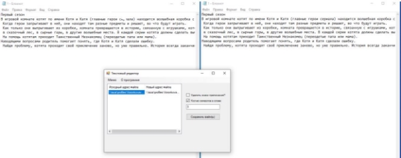
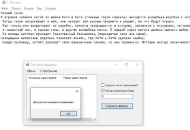
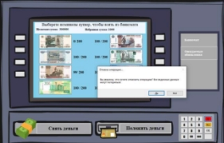
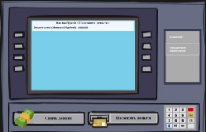
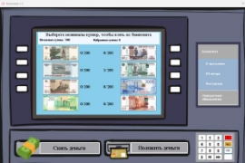
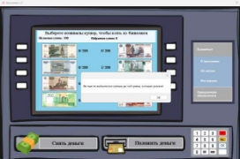

Баг-репорт - 1 

Баг | Сохранение файла с отрицательным параметром “Кол-во символов в слове”  

|**ID:**0001 |**Серьезность:** Средний** |**Приоритет:** Средний** |
| - | - | - |
|**Платформа:** OS Window 10** |**Статус**: Новый** |**Версия продукта:** v.1** |
|**Описание бага:** Дает возможность сохранить файл с отрицательным параметром “Кол-во символов в слове”** |||

|**История редактирований** ||
| - | :- |
|**Создан:** 12.04.2023 by Менглиев Давлатёр** |**Закреплен за:** 12.04.2023 by Воронкова В А** |
|**Сдал:** 12.04.2023 by Воронкова В А** |**Принял:** 12.04.2023 by Менглиев Давлатёр** |

|**Исполнительная часть** ||
| - | :- |
|**Шаги для воспроизведения бага** ||
|
1) Загрузить файл. 

2) Выделить флажок возле пункта “Кол-во символов в слове”. 

3) Ввести в поле отрицательное число. 

4) Нажимаем кнопку “Сохранить файл(ы)”. 
||
|**Ожидаемый результат** |**Фактический результат** |
|Программа не должна принимать отрицательное число.  |Программа принимает параметр и сохраняет файл. |
|||

Баг-репорт - 3 

Баг | Не работает параметр “Кол-во символов в слове”  

|**ID:**0010 |**Серьезность:** Высокая** |**Приоритет:** Средний** |
| - | - | - |
|**Платформа:** OS Window 10** |**Статус**: Новый** |**Версия продукта:** v.1** |
|**Описание бага:** Программа использует файл, даже после сохранения.** |||

|**История редактирований** ||
| - | :- |
|**Создан:** 17.04.2023 by Менглиев Давлатёр** |**Закреплен за:** 17.04.2023 by Воронкова В А** |
|**Сдал:** 17.04.2023 by Воронкова В А** |**Принял:** 17.04.2023 by Менглиев Давлатёр** |

|**Исполнительная часть** ||
| - | :- |
|**Шаги для воспроизведения бага** ||
|
1) Открыть txt файл. 

2) Выделить флажок возле пункта “Кол-во символов в слове”. 

3) Ввести в поле положительное число. 

4) Нажимаем кнопку “Сохранить файл(ы)”. 
||
|**Ожидаемый результат** |**Фактический результат** |
|Программа удаляет все слова длинна которых менее числа введенного в поле “Кол-во символов в слове” и сохраняет в файл. |Программа не сохраняет изменения в файле. |
|||

Баг | Программа удаляет все содержимое из файла 

|**ID:**1000 |**Серьезность:** Высокая** |**Приоритет:** Средний** |
| - | - | - |
|**Платформа:** OS Window 10** |**Статус**: Новый** |**Версия продукта:** v.1** |
|**Описание бага:** При сохранение файла, программа удаляет все содержимое файла.** |||

|**История редактирований** ||
| - | :- |
|**Создан:** 17.04.2023 by Менглиев Давлатёр** |**Закреплен за:** 17.04.2023 by Воронкова В А** |
|**Сдал:** 17.04.2023 by Воронкова В А** |**Принял:** 17.04.2023 by Менглиев Давлатёр** |

|**Исполнительная часть** ||
| - | :- |
|**Шаги для воспроизведения бага** ||
|
1) Открыть txt файл 

2) Сохранить его в исходную папку 
||
|**Ожидаемый результат** |**Фактический результат** |
|Программа обновляет исходный файл. |Программа при сохранении файла в папку, откуда импортировали данные, программа не перезаписывает файлы, а полностью удаляет содержимое. |
|||

Баг-репорт -4 

Баг | Сохранение количество купюр после отмены операции. 

|**ID:**0011 |**Серьезность:** Высокий** |**Приоритет:** Высокий** |
| - | - | - |
|**Платформа:** OS Window 10** |**Статус**: Новый** |**Версия продукта:** v.1** |
|**Описание бага:** Сохраняет количество купюр после отмены операции.** |||

|**История редактирований** ||
| - | :- |
|**Создан:** 12.04.2023 by Менглиев Давлатёр** |**Закреплен за:** 12.04.2023 by Воронкова В А** |
|**Сдал:** 12.04.2023 by Воронкова В А** |**Принял:** 12.04.2023 by Менглиев Давлатёр** |

|**Исполнительная часть** ||
| - | :- |
|**Шаги для воспроизведения бага** ||
|
1) Нажимаем на кнопку снять 

2) Берём какую-либо сумму  

3) Снимает некоторое количество купюр. 

4) Нажимаем на кнопку отмены операции 

5) Принимаем. 
||
|**Ожидаемый результат** |**Фактический результат** |
|При отмене операции купюры вернуться в исходное количество. |Купюры остались в том же количестве, что и до отмены операции. |
|||

Баг-репорт - 8 

Баг | Возможность вводить числа, состоящие из нулей. 

|**ID:**0100 |**Серьезность:** Низкий** |**Приоритет:** Низкий** |
| - | - | - |
|**Платформа:** OS Window 10** |**Статус**: Новый** |**Версия продукта:** v.1** |
|**Описание бага:** Возможность вводить числа, состоящие из нулей. К примеру 00010** |||

|**История редактирований** ||
| - | :- |
|**Создан:** 12.04.2023 by Менглиев Давлатёр** |**Закреплен за:** 12.04.2023 by Воронкова В А** |
|**Сдал:** 12.04.2023 by Воронкова В А** |**Принял:** 12.04.2023 by Менглиев Давлатёр** |

|**Исполнительная часть** ||
| - | :- |
|**Шаги для воспроизведения бага** ||
|
1) Нажать на кнопку “снять деньги” / “положить деньги” 

2) Ввести число, начинающее на цифру 0. 

3) Нажать на кнопку “Ок” 
||
|**Ожидаемый результат** |**Фактический результат** |
|Программа не должна давать возможность начинать число с 0 |Программа число принимает. |
|||

Баг | Нельзя снять все деньги 

|**ID:**0101 |**Серьезность:** Низкий** |**Приоритет:** Низкий** |
| - | - | - |
|**Платформа:** OS Window 10** |**Статус**: Новый** |**Версия продукта:** v.1** |
|**Описание бага:** Не дает возможность снять все деньги банкомата.** |||

|**История редактирований** ||
| - | :- |
|**Создан:** 12.04.2023 by Менглиев Давлатёр** |**Закреплен за:** 12.04.2023 by Воронкова В А** |
|**Сдал:** 12.04.2023 by Воронкова В А** |**Принял:** 12.04.2023 by Менглиев Давлатёр** |

|**Исполнительная часть** ||
| - | :- |
|**Шаги для воспроизведения бага** ||
|
5) Нажимаем на кнопку “Снять деньги” 

6) Вводит сумму, нужную для снятия всех денег (По умолчанию - 886 000) 
||
|**Ожидаемый результат** |**Фактический результат** |
|Программа даёт возможность снять все деньги |Программа не пропускает данное число |
|||

Баг | Нельзя заполнить полностью банкомат 

|**ID:**0110 |**Серьезность:** Низкий** |**Приоритет:** Низкий** |
| - | - | - |
|**Платформа:** OS Window 10** |**Статус**: Новый** |**Версия продукта:** v.1** |
|**Описание бага:** Не дает возможность пополнить на сумму, которая заполнит банкомата.** |||

|**История редактирований** ||
| - | :- |
|**Создан:** 17.04.2023 by Менглиев Давлатёр** |**Закреплен за:** 17.04.2023 by Воронкова В А** |
|**Сдал:** 17.04.2023 by Воронкова В А** |**Принял:** 17.04.2023 by Менглиев Давлатёр** |

|**Исполнительная часть** ||
| - | :- |
|**Шаги для воспроизведения бага** ||
|
1) Нажимаем на кнопку “Положить деньги” 

2) Вводит сумму, нужную для снятия всех денег (По умолчанию - 886 000) 
||
|**Ожидаемый результат** |**Фактический результат** |
|Программа даёт возможность пополнить банкомат, чтобы он был полный. |Программа не пропускает данное число |
|||

Баг | Банкомат не понимает какие купюры остались в нём. 

|**ID:**0111 |**Серьезность:** Высокий** |**Приоритет:** Средний** |
| - | - | - |
|**Платформа:** OS Window 10** |**Статус**: Новый** |**Версия продукта:** v.1** |
|**Описание бага:** Не дает возможность снять все деньги банкомата.** |||

|**История редактирований** ||
| - | :- |
|**Создан:** 17.04.2023 by Менглиев Давлатёр** |**Закреплен за:** 17.04.2023 by Воронкова В А** |
|**Сдал:** 17.04.2023 by Воронкова В А** |**Принял:** 17.04.2023 by Менглиев Давлатёр** |

|**Исполнительная часть** ||
| - | :- |
|**Шаги для воспроизведения бага** ||
|
1) Нажать на кнопку “Снять деньги” 

2) Ввести такую сумму, чтобы одной купюры не хватило для снятия. (К примеру: снять 1010 рублей десятирублёвой купюрой. ) 
||
|**Ожидаемый результат** |**Фактический результат** |
|Программа должна знать, сможет ли она выдать деньги из оставшихся купюр. Если не сможет, то не давать пользователю продолжить операцию |Программа пропускает пользователя, и не даёт её завершить т.к нельзя выбрать нужную сумму. |
|||

