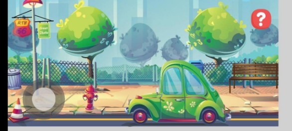

ОТЧЁТ ПО ЛАБОРАТОРНОЙ РАБОТЕ №10 Баг 1. Green Dhaka. Низкое качество спрайтов 

|ID: 01 |Серьезность: Средняя |Приоритет: Средний ||
| - | - | - | :- |
|Платформа: Android |Статус: Новый |Версия продукты: 1.0.0 ||
|Описание бага: Спрайты в игре представлены в плохом качестве или разрешении. ||||
|История редактирования ||||
|Создан: 13.06.2023 |Закреплен за: 13.06.2023 Воронкова |||
|Сдал: 13.06.2023 Воронкова |Принял: 13.06.2023 |||
|Исполнительная часть ||||
|Шаги для воспроизведения бага ||||
|1)  запустить приложение\. ||||
|Ожидаемый результат |Фактический результат |||
|||||
|![ref1]||||

Баг 2. Green Dhaka. Рамки по бокам экрана 

|ID: 02 |Серьезность: Низкая |Приоритет: Низкий |
| - | - | - |

|Платформа: Android |Статус: Новый |Версия продукты: 1.0.0 ||
| - | - | - | :- |
|Описание бага: В приложении видны рамки по бокам экрана. ||||
|История редактирования ||||
|Создан: 13.06.2023 |Закреплен за: 13.06.2023 Воронкова |||
|Сдал: 13.06.2023 Воронкова |Принял: 13.06.2023 |||
|Исполнительная часть ||||
|Шаги для воспроизведения бага ||||
|1)  запустить приложение ||||
|Ожидаемый результат |Фактический результат |||
|||||
|![ref1]||||

Баг 3. Green Dhaka. Выход за границы экрана

|ID: 03 |Серьезность: Высокий |Приоритет: Высокий |
| - | - | - |
|Платформа: Android |Статус: Новый |Версия продукты: 1.0.0 |
|Описание бага: существует возможность выйти за границы экрана, играя за персонажа. |||
|История редактирования |||

|Создан: 13.06.2023 |Закреплен за: 13.06.2023 Воронкова |
| - | - |
|Сдал: 13.06.2023 Воронкова |Принял: 13.06.2023 |
|Исполнительная часть ||
|Шаги для воспроизведения бага ||
|
1) запустить приложение; 

2) управляя персонажем, направить его вперед. 
||
|Ожидаемый результат |Фактический результат |
|Камера переместится с персонажем и отсутствует возможность выйти за границы экрана. |Персонаж пропадает из виду. |
|||

Баг 4. Green Dhaka. Сброс прогресса игры 

|ID: 04 |Серьезность: Высокая |Приоритет: Высокий ||
| - | - | - | :- |
|Платформа: Android |Статус: Новый |Версия продукты: 1.0.0 ||
|Описание бага: Сцена перезапускается после закрытия окна информации. ||||
|История редактирования ||||
|Создан: 13.06.2023 |Закреплен за: 13.06.2023 Воронкова |||
|Сдал: 13.06.2023 Воронкова |Принял: 13.06.2023 |||

|Исполнительная часть ||
| - | :- |
|Шаги для воспроизведения бага ||
|
1) запустить приложение; 

2) открыть окно информации; 

3) закрыть окно информации. 
||
|Ожидаемый результат |Фактический результат |
|Игра продолжается с того же места. |Сцена перезапускается. |
|||
Баг 5. Green Dhaka. Некорректное наслаивание спрайтов 

|ID: 05 |Серьезность: Средняя |Приоритет: Средняя ||
| - | - | - | :- |
|Платформа: Android |Статус: Новый |Версия продукты: 1.0.0 ||
|Описание бага: Спрайты некорректно наслаиваются. ||||
|История редактирования ||||
|Создан: 13.06.2023 |Закреплен за: 13.06.2023 Воронкова |||
|Сдал: 13.06.2023 Воронкова |Принял: 13.06.2023 |||
|Исполнительная часть ||||
|Шаги для воспроизведения бага ||||
|
1) запустить приложение; 

2) управляя персонажем зайти за машину. 
||||
|Ожидаемый результат |Фактический результат |||
|||||

Баг 6. Unlucky postman. Зависание загрузки 

|ID: 06 |Серьезность: Высокая |Приоритет: Высокий  ||
| - | - | - | :- |
|Платформа: Android |Статус: Новый |Версия продукты: granny android debug 656 ||
|Описание бага: Загрузка приложения зависает на 90%. ||||
|История редактирования ||||
|Создан: 13.06.2023 |Закреплен за: 13.06.2023 Воронкова |||
|Сдал: 13.06.2023 Воронкова |Принял: 13.06.2023 |||
|Исполнительная часть ||||
|Шаги для воспроизведения бага ||||
|1)  запустить приложение\. ||||
|Ожидаемый результат |Фактический результат |||
|||||

Баг 7. Office management 101. Возможность выхода за границу карты 

|ID: 07 |Серьезность: Средняя |Приоритет: Средний ||
| - | - | - | :- |
|Платформа: Windows 11 |Статус: Новый |Версия продукты: 0.5.1 alpha ||
|Описание бага: отсутствует ограничение перемещения по карте. ||||
|История редактирования ||||
|Создан: 13.06.2023 |Закреплен за: 13.06.2023 Воронкова |||
|Сдал: 13.06.2023 Воронкова |Принял: 13.06.2023 |||
|Исполнительная часть ||||
|Шаги для воспроизведения бага ||||
|
1) запустить приложение; 

2) начать вести курсор в сторону. 
||||
|Ожидаемый результат |Фактический результат |||
|||||

Баг 8. Office management 101. Некорректное перемещение камеры 

|ID: 8 |Серьезность: Средняя |Приоритет: Средний ||
| - | - | - | :- |
|Платформа: Windows 11|Статус: Новый |Версия продукты: 0.5.1 alpha ||
|Описание бага: Камера перемещается некорректно в максимальном увеличении камеры при ее медленном панорамировании (ведем мышку вправо, а перемещает вниз). ||||
|История редактирования ||||
|Создан: 13.06.2023 |Закреплен за: 13.06.2023 Воронкова |||
|Сдал: 13.06.2023 Воронкова |Принял: 13.06.2023 |||
|Исполнительная часть ||||
|Шаги для воспроизведения бага ||||
|1)  Запустить приложение ||||
|Ожидаемый результат |Фактический результат |||
|||||
|||||
Баг 9. Township. Завершение работы приложения во время загрузки 

|ID: 09 |Серьезность: Высокая |Приоритет: Высокий ||
| - | - | - | :- |
|Платформа: Android |Статус: Новый |Версия продукта: v7a ||
|Описание бага: происходит сбой, приложение закрывается во время загрузки после запуска или на экране загрузки. ||||
|История редактирования ||||
|Создан: 13.06.2023 |Закреплен за: 13.06.2023 Воронкова |||
|Сдал: 13.06.2023 Воронкова |Принял: 13.06.2023 |||
|Исполнительная часть ||||
|Шаги для воспроизведения бага ||||
|1)  запустить приложение\. ||||
|Ожидаемый результат |Фактический результат |||
|||||
|||||
Баг 10. Township. Завершение работы приложения после экрана загрузки 

|ID: 02 |Серьезность: Высокая |Приоритет: Высокий ||
| - | - | - | :- |
|Платформа: Android |Статус: Новый |Версия продукта: v8a ||
|Описание бага: происходит сбой, приложение закрывается во время загрузки после запуска или на экране загрузки. ||||
|История редактирования ||||
|Создан: 13.06.2023 |Закреплен за: 13.06.2023 Воронкова |||
|Сдал: 13.06.2023 Воронкова |Принял: 13.06.2023 |||
|Исполнительная часть ||||

|Шаги для воспроизведения бага ||
| - | :- |
|1)  запустить приложение\. ||
|Ожидаемый результат |Фактический результат |
|||
|||

[ref1]: Aspose.Words.5ffa8eae-4cd8-4873-991b-24911d2408e7.001.jpeg
