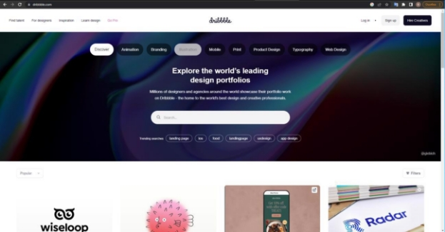

ВВЕДЕНИЕ

**Dribbble** – это веб-сервис и социальная сеть для дизайнеров и креативных  профессионалов.  Она  была  создана  в  2009  году  и предназначена для демонстрации и обмена дизайн-проектами, а также для поиска и нахождения работы. 

` `Dribbble имеет множество функций, позволяющих пользователям создавать свои профили, загружать свои работы и получать обратную связь  от  коллег  и  других  участников  сообщества.  Кроме  того, пользователи  могут  найти  работу  или  связаться  с  другими профессионалами для совместных проектов. 

` `Dribbble  является  одним  из  самых  популярных  ресурсов  в области  дизайна  и  является  важным  инструментом  для  развития профессиональных навыков и карьеры в этой сфере. 

Ссылка на сайт:[ https://dribbble.com/ ](https://dribbble.com/)

Рисунок 1 – Скриншот сайта Dribbble 

ТЕСТ-КОМПЛЕКТ 1: ОСНОВНЫЕ ФУНКЦИОНАЛЬНЫЕ ПРОВЕРКИ

1\. Тест-кейс 1: Проверка загрузки главной страницы Шаги: 

1. Открыть веб-сайт [ dribble.com ](https://vk.com/away.php?utf=1&to=http%3A%2F%2Fdribble.com)
1. Проверить, что страница успешно загружена 
1. Проверить наличие основных элементов интерфейса (логотип, меню, поиск и т.д.) 
1. Проверить  правильность  отображения  контента  на странице 

Ожидаемый  результат:  Главная  страница  успешно загружена и содержит корректно отображаемый контент. 

2\. Тест-кейс 2: Поиск дизайнов на сайте Шаги: 

1. Открыть сайт[ dribble.com ](https://vk.com/away.php?utf=1&to=http%3A%2F%2Fdribble.com)
1. В  поле  "Поиск"  вверху  страницы  ввести  ключевые слова для поиска, например, "mobile app design" 
1. Нажать кнопку "Поиск" 
1. Проверить  результаты  поиска  на  соответствие введенному ключевому слову 
1. Проверить  правильность  отображения  найденных проектов 

Ожидаемый результат: На странице появится результаты поиска с дизайнами, например, изображения мобильных приложений. 

3\. Тест-кейс 3: Проверка просмотра проекта Шаги: 

1. Открыть сайт[ dribble.com ](https://vk.com/away.php?utf=1&to=http%3A%2F%2Fdribble.com)
1. Выбрать  проект  из  списка  результатов  или  из категории 
1. Проверить, что страница проекта успешно загружена 
1. Проверить  отображение  основной  информации  о проекте (название, описание, изображения и т.д.) 
5. Проверить  наличие  кнопок  или  элементов  для взаимодействия  с  проектом  (например,  кнопка "Понравилось") 

Ожидаемый результат: Страница проекта отображается корректно и содержит соответствующую информацию. 

4\. Тест-кейс 4: Добавление дизайна в коллекцию Шаги:  

1. Открыть сайт[ dribble.com ](https://vk.com/away.php?utf=1&to=http%3A%2F%2Fdribble.com)
1. Найти нужный дизайн на странице 
1. Нажать на иконку "Коллекция" под дизайном  
1. Выбрать существующую или создать новую коллекцию  

Ожидаемый результат: Дизайн добавится в выбранную коллекцию успешно. 

5. Тест-кейс 5: Проверка подписки на пользователя Шаги: 
1. Открыть сайт[ dribble.com ](https://vk.com/away.php?utf=1&to=http%3A%2F%2Fdribble.com)
1. Выбрать пользователя, на которого хоти подписаться 
1. Нажать на кнопку "Подписаться" 
1. Проверяем, что пользователь отображается в списке подписок 

Ожидаемый  результат:  Выбранный  пользователь успешно отображается на странице подписок. 

ТЕСТ-КОМПЛЕКТ 2: АККАУНТ И ВЗАИМОДЕЙСТВИЕ ПОЛЬЗОВАТЕЛЯ

1\. Тест-кейс 1: Проверка регистрации нового пользователя Шаги: 

1. Открыть сайт[ dribble.com ](https://vk.com/away.php?utf=1&to=http%3A%2F%2Fdribble.com)
1. Нажать кнопку "Регистрация" 
1. Заполнить  поля  "Имя",  "Фамилия",  "Электронная почта" и "Пароль" 
1. Нажать кнопку "Зарегистрироваться" 
1. Проверить  успешное  создание  аккаунта  и автоматический вход 

Ожидаемый результат: Регистрация нового пользователя проходит  успешно,  и  пользователь  успешно  входит  в систему и автоматически перенаправляется на главную страницу сайта. 

2\. Тест-кейс 2: Проверка авторизации пользователя Шаги: 

1. Открыть сайт[ dribble.com ](https://vk.com/away.php?utf=1&to=http%3A%2F%2Fdribble.com)
1. Нажать кнопку "Вход" 
1. Ввести  правильный  "Email"  и  "Пароль" зарегистрированного пользователя 
1. Нажать кнопку "Войти" 
1. Проверить  успешную  авторизацию  и  переход  на главную страницу 

Ожидаемый  результат:  Пользователь  авторизован успешно  и  перенаправлен  на  главную  страницу  сайта. 

3\. Тест-кейс  3:  Проверка  редактирования  профиля пользователя 

Шаги: 

1. Открыть сайт[ dribble.com ](https://vk.com/away.php?utf=1&to=http%3A%2F%2Fdribble.com)
1. Нажать на аватарку пользователя в верхнем правом углу страницы  
3. Нажать  на  кнопку  "Редактировать  профиль"  или аналогичный элемент 
3. Внести  необходимые  изменения  (например,  фото профиля, описание и т.д.) 
3. Сохранить изменения и проверить их отображение на странице профиля 

Ожидаемый  результат:  Редактирование  профиля пользователя  проходит  успешно,  и  изменения отображаются на странице профиля. 

4\. Тест-кейс 4: Просмотр профиля пользователя Шаги: 

1. Открыть сайт[ dribble.com ](https://vk.com/away.php?utf=1&to=http%3A%2F%2Fdribble.com)
1. Нажать на аватарку пользователя в верхнем правом углу страницы  
1. Нажать на пункт меню "Мой профиль" 

Ожидаемый  результат:  Отобразится  профиль пользователя  с  его  основной  информацией,  галереей дизайнов  этого  пользователя  и  другими  настройками.  

5\. Тест-кейс 5: Проверка комментирования дизайнов Шаги: 

1. Открыть сайт[ dribble.com ](https://vk.com/away.php?utf=1&to=http%3A%2F%2Fdribble.com)
1. Найти нужный дизайн на странице 
1. Нажать на кнопку "Комментарии" 
1. Написать комментарий в поле "Добавить комментарий" и нажать кнопку "Отправить" 
1. Проверить,  что  комментарий  успешно  добавлен  и отображается на странице проекта 

Ожидаемый результат: Комментарий добавится успешно и появится на странице дизайна. 

ВЫВОДЫ

В результате разработки двух тест-комплектов для мануального тестирования веб-сайта Dribbble [(dribble.com)](https://vk.com/away.php?utf=1&to=http%3A%2F%2Fdribble.com) можно сделать следующие выводы:  

- Первый тест-комплект, "Основные функциональные проверки", покрывает основные функции и интерфейс веб-сайта. Он включает проверку загрузки главной страницы, функциональности поиска проектов, просмотра проектов, добавление дизайна в коллекцию и проверку подписки на пользователя. 

  Этот тест-комплект поможет убедиться в правильной работе ключевых функциональностей платформы. 

- Второй тест-комплект, "Аккаунт и взаимодействие пользователя", сфокусирован на функциональности аккаунта пользователя и его взаимодействии с Dribbble. Он включает проверку регистрации и авторизации пользователей, редактирования и просмотра профиля, функциональности комментирования дизайнов.  

  Этот тест-комплект поможет удостовериться, что пользователи могут успешно взаимодействовать с платформой и использовать ее возможности. 

- Оба тест-комплекта представляют важные аспекты функциональности и пользовательского опыта Dribbble. Проведение мануального тестирования с использованием этих тест-кейсов поможет выявить возможные проблемы, ошибки и недоработки в работе веб-сайта. 
- По мере создания тест-кейсов для сайта Dribbble не было выявлено никаких багов.  
